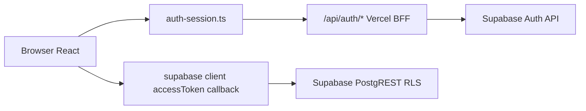

# GodCode-Panel — Instrucciones para agentes

## Overview

**GodCode Caja** es un panel POS/admin en español para restaurantes: pedidos, mesas, caja, inventario y clientes.

| Tema | Detalle |
|------|---------|
| Stack | React 19, Vite, Supabase, Vercel BFF |
| Código principal | `src/modules/cash/` |
| Entry | `src/app.tsx` |
| Package manager | **pnpm** |

## Reglas duras (prioridad máxima)

### Auth BFF — NO negociable

La autenticación del frontend pasa por un BFF de cookies httpOnly. Ver `src/integrations/supabase/client.ts` y `src/integrations/supabase/auth-session.ts`.

- **Nunca** usar `supabase.auth.*` en el frontend.
- El refresh token vive en la cookie httpOnly `gc_rt`; el access token solo en memoria.
- Endpoints BFF: `/api/auth/*` (dev: plugin Vite; prod: `api/auth/`).
- El cliente Supabase usa `accessToken: () => getAccessToken()` — el namespace `auth` queda deshabilitado.
- Para login, logout, refresh y sesión, usar las funciones de `auth-session`, no Supabase Auth directo.

```javascript
// ❌ PROHIBIDO en frontend
await supabase.auth.signInWithPassword({ email, password });

// ✅ CORRECTO
import { login, logout, bootstrapSession, getAccessToken } from '@/integrations/supabase/auth-session';
await login(email, password);
await logout();
await bootstrapSession();
```

Flujo de auth:



### Cambios mínimos — NO negociable

- Resolver **solo** lo pedido; no refactors colaterales.
- No convertir masivamente `.jsx` → `.tsx` ni reorganizar carpetas sin pedido explícito.
- No agregar dependencias nuevas salvo que el task lo requiera.
- No commitear `.env` ni secrets.
- Solo crear commits o PRs cuando el usuario lo pida explícitamente.
- Seguir el estilo del archivo tocado (comillas, indentación, patrones existentes).

## Contexto útil

| Tema | Regla |
|------|-------|
| Supabase tablas | Usar constante `TABLES` de `@/integrations/supabase`, no strings sueltos |
| Path alias | `@/` → `src/` |
| CSS | Plain CSS global en `src/modules/cash/styles/`, importado en `app.tsx` — **no** CSS Modules ni Tailwind |
| Tests | Viven en `tests/`, no colocados en `src/` |
| Migraciones DB | Nuevos cambios de schema en `supabase/migrations/` |
| Idioma UI | Español rioplatense donde corresponda ("Copiá", "pegá") |

## Comandos

```bash
pnpm dev           # servidor de desarrollo
pnpm test          # unit + component
pnpm test:e2e      # playwright (requiere credenciales E2E)
pnpm build         # tsc + vite build
```

Tras cambios relevantes, correr `pnpm test`. Si se tocó CSS responsive u orders, correr también los tests específicos de esa área.

## Paleta de colores

| Token | Valor |
|-------|-------|
| VERDE | `#00e4bb` |
| SALMON | `#ff5879` |
| ROJO | `#c31d2d` |
| AZUL | `#0078ff` |
| FONDO EN TODO | `#fffffb` |
| NARANJA | `#ea7b4b` |
| AZUL OSCURO | `#12597a` |

## Tipografía

La fuente oficial del sistema es **Inter** (variable, 100–900), cargada vía Google Fonts en `index.html` con `display=swap`.

| Capa | Configuración |
|------|---------------|
| Fuente sans global | `Inter`, `system-ui`, `sans-serif` |
| Tailwind v4 | `--font-sans` en `src/styles/tailwind.css` |
| Aplicación global | `html { font-family: var(--font-sans); }` en `tailwind.css` |

### Escala de pesos

| Peso | Clase Tailwind | Uso |
|------|----------------|-----|
| 400 Regular | `font-normal` | Texto de soporte, descripciones, notas |
| 500 Medium | `font-medium` | Labels de KPI, nombres de producto, texto de tags |
| 600 SemiBold | `font-semibold` | Títulos de sección, valores de KPI |
| 700 Bold | `font-bold` | Montos totales, timers con urgencia, títulos principales de página |

### Números tabulares

Todos los valores numéricos del sistema usan `font-variant-numeric: tabular-nums` (aplicado globalmente en `html`), incluyendo montos, porcentajes, timers y cantidades. Esto evita que los dígitos "bailen" de ancho al actualizarse en tiempo real.

### Internacionalización

Inter cubre latin-ext, así que tildes, eñes y signos de apertura (`¿`, `¡`) se renderizan correctamente en todo el UI.

## Especificaciones de onboarding (docs/)

Specs de implementación para capacitación del panel (no son manuales de usuario):

- [`docs/README.md`](docs/README.md) — índice y flujo de referencia del pedido manual
- [`docs/KIOSK-DEMO-PEDIDO-MANUAL.md`](docs/KIOSK-DEMO-PEDIDO-MANUAL.md) — demo automática en loop (kiosk)
- [`docs/TOUR-PANEL-CAJA.md`](docs/TOUR-PANEL-CAJA.md) — tour interactivo en el panel autenticado