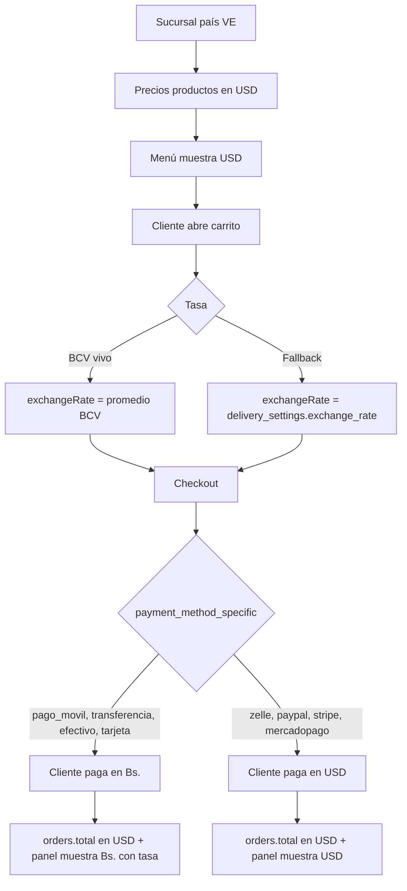
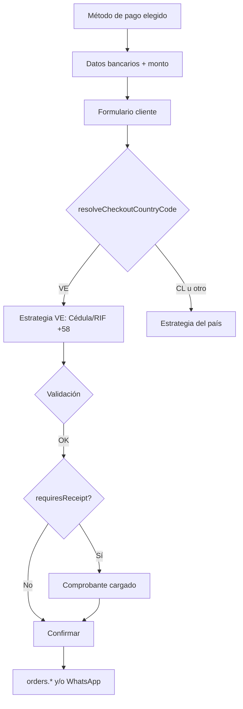
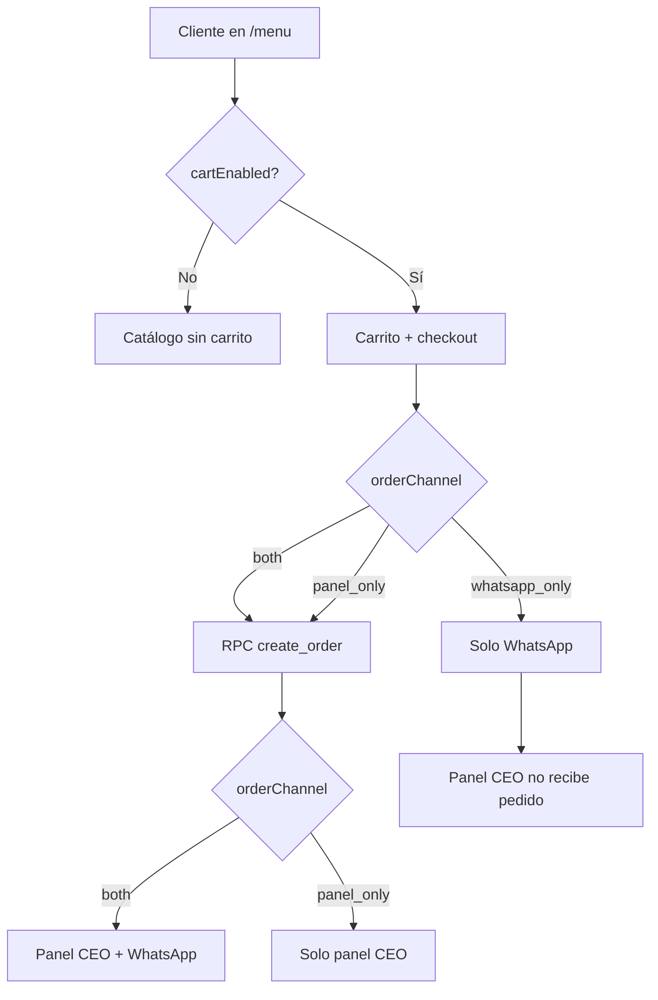

# Panel CEO: canal de pedidos, carrito y dual currency Venezuela (GodCode-Panel)

## Contexto

Este documento cubre tres integraciones del **panel CEO** (GodCode-Panel) con el menú público:

1. **Canal de pedidos** — carrito on/off y si los checkout llegan por panel, WhatsApp o ambos.
2. **Venezuela USD / Bs.** — cómo se muestran, convierten y cobran los montos según método de pago.
3. **Datos del cliente en checkout (VE)** — cédula/RIF, teléfono +58 y comprobante según método de pago.

El dueño configura el canal desde **Cuenta → Tienda** (`/cuenta`, pestaña **Tienda**):

| Modo (`orderChannel`) | Menú (checkout) | ¿Llega al panel CEO? | ¿Abre WhatsApp? |
|------------------------|-----------------|----------------------|-----------------|
| `both` | Carrito normal | Sí (`create_order_transaction`) | Sí |
| `whatsapp_only` | Carrito normal | **No** | Sí |
| `panel_only` | Carrito normal | Sí | No |

Además existe el toggle **`cartEnabled`**: si está en `false`, el menú es solo catálogo (sin carrito, sin checkout).

**Objetivo de este documento:** que el **panel CEO** (GodCode-Panel / app de operación) sepa qué modo está activo y **desactive o adapte** pantallas que no aplican — por ejemplo, si solo reciben por WhatsApp, la cola de pedidos online del panel no tendrá entradas nuevas desde el menú.

---

## Dónde configura el cliente

| Paso | Dónde |
|------|--------|
| 1 | Iniciar sesión en `/cuenta` (rol CEO) |
| 2 | Pestaña **Tienda** |
| 3 | Bloque **Carrito y pedidos** (arriba del editor de tema) |
| 4 | Activar/desactivar **Mostrar carrito en el menú** |
| 5 | Elegir **Canal de pedidos** (solo si el carrito está activo) |
| 6 | **Guardar configuración** |

Restricciones:

- Solo el **CEO** puede guardar (`PUT /api/customer-account/menu-settings`).
- Si el plan no incluye `online_ordering`, el carrito no se puede activar aunque el toggle esté marcado.

---

## Dónde se guarda (fuente de verdad)

Tabla: `companies.integration_settings` (JSON).

Bloque:

```json
{
  "menu": {
    "cartEnabled": true,
    "orderChannel": "both"
  }
}
```

| Campo | Tipo | Default | Valores |
|-------|------|---------|---------|
| `cartEnabled` | `boolean` | `true` | `true` / `false` |
| `orderChannel` | `string` | `"both"` | `"both"` \| `"whatsapp_only"` \| `"panel_only"` |

Otros datos del mismo JSON (p. ej. `uber`) **no se tocan** al guardar menú.

---

## Cómo sabe el panel CEO qué opción está activa

### 1. Leer desde Supabase (recomendado al iniciar sesión / bootstrap)

```sql
SELECT integration_settings, plan_id, plans(features)
FROM companies
WHERE id = :companyId;
```

En código (mismo parser que usa el menú):

```ts
import {
  extractMenuSettingsFromIntegration,
  resolveOnlineOrderingEnabled,
  shouldPersistOrderToPanel,
  shouldOpenWhatsAppOnCheckout,
  requiresOpenShiftForCheckout,
  type CompanyMenuSettings,
  type OrderChannelMode,
} from "@/lib/tenant/menu-settings";

const menuSettings = extractMenuSettingsFromIntegration(company.integration_settings);
const planFeatures = company.plans?.features;
const onlineOrderingEnabled = resolveOnlineOrderingEnabled(planFeatures, menuSettings);
```

### 2. API existente (portal cuenta — solo CEO autenticado en `/cuenta`)

| Método | Ruta | Uso |
|--------|------|-----|
| `GET` | `/api/customer-account/menu-settings` | Devuelve `{ menuSettings, planAllowsOnlineOrdering }` |
| `PUT` | `/api/customer-account/menu-settings` | Guarda `cartEnabled` y/o `orderChannel` |

**Nota:** hoy esta API está pensada para el portal `/cuenta`. El panel CEO debería exponer su propio endpoint de bootstrap (p. ej. `GET /api/tenant/company-context`) que incluya `menuSettings` parseados, o leer `integration_settings` en el login del panel con el mismo helper.

### 3. Helpers ya disponibles (usar en panel — no duplicar lógica)

Archivo: `lib/tenant/menu-settings.ts`

| Función | Qué responde |
|---------|----------------|
| `extractMenuSettingsFromIntegration(raw)` | `{ cartEnabled, orderChannel }` normalizado |
| `resolveOnlineOrderingEnabled(planFeatures, menuSettings)` | ¿Menú muestra carrito? (plan + toggle) |
| `shouldPersistOrderToPanel(orderChannel)` | ¿Checkout crea fila en `orders`? |
| `shouldOpenWhatsAppOnCheckout(orderChannel)` | ¿Checkout abre `wa.me`? |
| `requiresOpenShiftForCheckout(orderChannel)` | ¿Checkout exige turno de caja abierto? |

Ejemplo de flags derivados para el panel:

```ts
const { cartEnabled, orderChannel } = menuSettings;

const panelReceivesMenuOrders = cartEnabled && shouldPersistOrderToPanel(orderChannel);
const menuUsesWhatsApp = cartEnabled && shouldOpenWhatsAppOnCheckout(orderChannel);
const menuRequiresShift = cartEnabled && requiresOpenShiftForCheckout(orderChannel);
```

---

## Comportamiento actual en el menú (ya implementado)

| Condición | Efecto en menú público |
|-----------|-------------------------|
| `cartEnabled === false` o plan sin `online_ordering` | Sin carrito, sin `CartProvider`, sin botones "+" |
| `whatsapp_only` | Checkout **no** llama `create_order_transaction`; abre WhatsApp con resumen |
| `panel_only` | Checkout crea pedido en BD; **no** abre WhatsApp |
| `both` | Crea pedido + abre WhatsApp (comportamiento histórico) |
| `whatsapp_only` + caja cerrada | El cliente **sí** puede pagar/enviar (no exige turno abierto) |
| `both` / `panel_only` + caja cerrada | Checkout bloqueado hasta abrir turno |
| Cualquier modo + `order_intake_paused` en sucursal | Checkout bloqueado (mensaje de pausa) |

Referencias en este repo:

| Qué | Archivo |
|-----|---------|
| Lectura en SSR menú | `app/[subdomain]/menu/page.tsx` |
| Sin carrito → sin provider | `components/tenant/menu/menu-client.tsx` |
| Rama checkout por canal | `components/tenant/cart/views/cart-modal.tsx` |
| UI configuración | `components/customer-portal/account/menu-order-settings-card.tsx` |
| API guardado | `app/api/customer-account/menu-settings/route.ts` |

Invalidación de caché al guardar: tags `menu:{companyId}` y `company-slug:{publicSlug}`.

---

## Venezuela: dólares y bolívares (USD / VES)

### Resumen del modelo

En tenants venezolanos el sistema usa un **modelo dual**:

| Concepto | Valor en Venezuela |
|----------|------------------|
| **Moneda de referencia del catálogo y del carrito** | **USD** (precios de productos, subtotales, `orders.total`) |
| **Moneda de cobro al cliente** | Depende del **método de pago** elegido: bolívares (métodos locales) o dólares (métodos internacionales) |
| **Tasa de conversión USD → Bs.** | Tasa BCV en vivo al abrir el carrito, con fallback manual en la sucursal |

El panel CEO debe alinearse con esto: **cargar precios en USD**, configurar métodos de pago por sucursal, y al mostrar un pedido o monto a cobrar **respetar el método de pago** (no mostrar siempre la misma moneda).

---

### Cómo se detecta “modo Venezuela”

País efectivo (menú y carrito):

```ts
effectiveCountry = branch.country ?? company.country
```

Se considera Venezuela si:

```ts
country === "VE" || country === "Venezuela"
```

Helper compartido:

```ts
import { isVenezuelaCountry } from "@/components/tenant/cart/utils/venezuela-payment-copy";
```

| Campo DB | Tabla | Uso |
|----------|-------|-----|
| `country` | `companies`, `branches` | Activa lógica Venezuela |
| `currency` | `companies`, `branches` | Moneda “contable” de la sucursal (p. ej. `VES`); en menú/carrito VE el checkout **fuerza USD** como moneda del carrito |
| `payment_methods` | `branches` | Slugs habilitados (`pago_movil`, `zelle`, etc.) |
| `pago_movil`, `zelle`, `transferencia_bancaria`, … | `branches` | JSON de datos bancarios (teléfono PM, cuenta, email Zelle, etc.) |
| `delivery_settings` | `branches` | JSON; incluye `exchange_rate` / `exchangeRate` como **tasa manual de respaldo** |

Moneda efectiva en menú:

```ts
effectiveCurrency = branch.currency ?? company.currency
```

En carrito (`CartProvider`), si `isVenezuela`:

```ts
cartCurrency = "USD"   // aunque branch.currency sea VES
```

---

### Precios en el menú público

| Pantalla | Qué ve el cliente |
|----------|-------------------|
| **Tarjetas de producto** (país VE) | Precio **solo en USD** (`$X.XX`) |
| **Carrito / checkout** | Total principal en **USD** + equivalente en **Bs.** entre paréntesis cuando hay tasa |
| **Detalle de pago** | Monto según método (ver tabla abajo) |

Los precios en BD (`products.price`, `discount_price`, precios por sucursal) para tenants VE deben interpretarse como **montos en dólares**.

**Tasa en catálogo:** el menú lee `exchangeRate` solo desde `branches.delivery_settings` (no consulta BCV en tiempo real en la grilla). En VE las tarjetas priorizan USD, así que el dual en catálogo es secundario.

---

### Tasa de cambio (USD → Bs.)

#### Fuentes (orden de prioridad en **carrito**)

1. **BCV en vivo** — al abrir el carrito, si país es VE:
   - `GET https://ve.dolarapi.com/v1/dolares/oficial`
   - Campo usado: `promedio`
2. **Fallback manual** — `branches.delivery_settings.exchange_rate` (o `exchangeRate`)

```ts
// cart-provider.tsx
effectiveExchangeRate = isVenezuela
  ? (bcvRate ?? deliverySettings.exchangeRate ?? null)
  : (deliverySettings.exchangeRate ?? null);
```

#### Dónde configura el panel CEO la tasa manual

En el JSON `branches.delivery_settings`:

```json
{
  "exchange_rate": 639.703,
  "enabled": true,
  "...": "..."
}
```

> **Importante:** si BCV no responde y no hay `exchange_rate` en la sucursal, el carrito muestra solo USD (sin equivalente en Bs.) y el copy de pago móvil no puede convertir a bolívares.

**Recomendación para el panel:** pantalla de configuración de envío / sucursal con campo **“Tasa de cambio (Bs. por USD)”** que escriba `exchange_rate` en `delivery_settings`. Mostrar también la tasa BCV en vivo como referencia (misma API o endpoint interno).

---

### Métodos de pago → moneda que ve / paga el cliente

Clasificación fija en `venezuela-payment-copy.ts`:

#### Cobran en **bolívares** (VES)

| Slug | Uso típico |
|------|------------|
| `pago_movil` | Pago móvil |
| `transferencia_bancaria` | Transferencia local |
| `efectivo` | Efectivo Bs. |
| `tarjeta` | Punto / débito local |

#### Cobran en **dólares** (USD)

| Slug | Uso típico |
|------|------------|
| `zelle` | Zelle |
| `paypal` | PayPal |
| `stripe` | Tarjeta internacional |
| `mercadopago` | Mercado Pago (USD) |

Helpers:

```ts
import {
  paymentMethodUsesBolivaresInVenezuela,
  paymentMethodUsesUsdInVenezuela,
  resolvePaymentAmountCopyValue,
  resolvePaymentAmountDisplay,
  resolvePaymentAmountMessageValue,
} from "@/components/tenant/cart/utils/venezuela-payment-copy";
```

#### Comportamiento por contexto

| Contexto | Método en Bs. (p. ej. `pago_movil`) | Método en USD (p. ej. `zelle`) |
|----------|--------------------------------------|--------------------------------|
| **Pantalla de datos de pago** (display) | `$2,500.00 / Bs. 1.599.257,50` | `$2,500.00` |
| **Copiar monto** (portapapeles) | `1599257,50` (solo número en Bs., sin símbolo) | `$2,500.00` |
| **Mensaje WhatsApp** | `Bs. 1.599.257,50 ($2,500.00)` | `$2,500.00` |
| **Resumen carrito** | USD grande + `(Bs. …)` debajo | USD |

Fórmula:

```ts
vesAmount = usdTotal * exchangeRate
```

---

### Qué se persiste en `orders` (panel CEO)

| Campo | Venezuela | Notas para el panel |
|-------|-----------|---------------------|
| `total`, `subtotal`, `delivery_fee`, `tax_total` | Montos en **USD** (misma unidad que el carrito) | Mostrar `$` como principal |
| `currency` | Puede venir del RPC; el menú calcula en USD | No asumir `VES` en el total guardado |
| `payment_method_specific` | Slug (`pago_movil`, `zelle`, …) | **Clave** para saber si el cliente pagó en Bs. o USD |
| Tasa usada en checkout | **No se guarda hoy** en `orders` | Para mostrar Bs. históricos en detalle de pedido, el panel debe guardar tasa en el futuro o recalcular con tasa actual (documentar limitación) |

Al mostrar un pedido en GodCode-Panel:

```ts
const isVe = isVenezuelaCountry(branch.country ?? company.country);
const method = order.payment_method_specific;
const usdTotal = order.total ?? 0;

if (isVe && method && paymentMethodUsesBolivaresInVenezuela(method)) {
  // Mostrar total principal en Bs. si tienes tasa (actual o guardada)
  // Secundario: USD
  display = resolvePaymentAmountMessageValue({
    methodKey: method,
    grandTotal: usdTotal,
    currency: "USD",
    exchangeRate: currentOrStoredRate,
    country: "VE",
  });
} else if (isVe) {
  display = formatCartMoney(usdTotal, "USD");
}
```

---

### Qué debe configurar el panel CEO (checklist Venezuela)

| Área del panel | Qué configurar | Efecto en menú |
|----------------|----------------|----------------|
| **Empresa / sucursal → País** | `VE` o `Venezuela` | Activa USD en catálogo y dual en carrito |
| **Productos** | Precios en **dólares** | Tarjetas y carrito coherentes |
| **Métodos de pago** (`payment_methods` + JSON por método) | Habilitar slugs y completar datos (banco, teléfono PM, email Zelle…) | Checkout muestra solo métodos configurados |
| **Envío / `delivery_settings`** | `exchange_rate` manual | Fallback si BCV falla; usado también en catálogo |
| **Impuestos** (`delivery_settings.tax_rate`, `tax_included`) | IVA si aplica | `calculateCartTotals` en carrito |
| **Caja / turnos** | Apertura de turno | Obligatorio para checkout en modos `both` y `panel_only` (no en `whatsapp_only`) |

Pestañas del panel relacionadas (`tenant-admin-tabs.ts`):

| ID | Relación con USD/VES |
|----|----------------------|
| `payment_methods` | Datos bancarios y slugs por sucursal |
| `products` | Precios en USD para VE |
| `orders` | Mostrar total según `payment_method_specific` + tasa |
| `caja` | Montos de cierre; definir si reportes en USD o Bs. según negocio |

---

### Matriz panel CEO: visualización de montos

| Pantalla del panel | Regla recomendada |
|--------------------|-------------------|
| **Lista de pedidos** | Columna principal **USD**; columna opcional Bs. si método local y hay tasa |
| **Detalle de pedido** | Usar `resolvePaymentAmountMessageValue` con `payment_method_specific` |
| **Comanda / impresión** | Misma regla que detalle; cocina suele ver USD + Bs. entre paréntesis |
| **Caja — resumen del día** | Definir política: reportar en USD (referencia) y conversión Bs. para métodos locales |
| **Config sucursal VE** | Campo tasa `exchange_rate` + aviso “BCV se actualiza al abrir el carrito del cliente” |
| **Validación de pago** | Si método es `pago_movil`, destacar monto en **Bs.** para cajero/revisor |

---

### Formato de dinero (reutilizar en panel)

```ts
import { formatCartMoney, formatCartAmountPlain } from "@/components/tenant/cart/utils/format-cart-money";
```

| Moneda | Ejemplo |
|--------|---------|
| USD | `$2,500.00` |
| VES | `Bs. 1.599.257,50` |
| Copia bancaria Bs. | `1599257,50` (sin prefijo — `formatCartAmountPlain`) |

---

### Flujo dual currency (diagrama)



---

### Datos del cliente al final del carrito (Venezuela)

Al terminar el flujo de pago, el menú muestra el formulario **“Datos del cliente”** (`CartPaymentFlow`) antes de confirmar. En Venezuela no es un formulario distinto: usa la **misma pantalla** que otros países, pero con la **estrategia de país `VE`** (`getFormStrategy`) que cambia etiquetas, máscaras y validación.

#### Cuándo aparece el formulario

Flujo típico del carrito:

1. Revisar ítems → **Ir a pagar**
2. Elegir método de pago (`pago_movil`, `zelle`, etc.)
3. Ver datos bancarios / monto a transferir (`CartOnlinePaymentDetails`)
4. **Formulario de datos del cliente** (`showForm = true`)
5. Confirmar → crear pedido (si aplica) y/o abrir WhatsApp

El borrador del cliente se guarda en sesión (`checkoutSession.clientDraft` en Zustand) mientras el carrito sigue abierto.

#### Cómo se elige la estrategia Venezuela

País del checkout (sin inferir por método de pago):

```ts
import { getFormStrategy, resolveCheckoutCountryCode } from "@/lib/geo/country-forms";

const effectiveCountryCode = resolveCheckoutCountryCode({
  branchCountry: branch.country,      // prioridad 1
  businessCountry: businessInfo.country,
  cartCountry: cartCountry,
});
// "VE" si branch.country es "VE" o "Venezuela"

const strategy = getFormStrategy(effectiveCountryCode);
```

| Origen | Campo |
|--------|--------|
| 1ª prioridad | `branches.country` de la sucursal del pedido |
| 2ª | `business_info` / empresa |
| 3ª | país del `CartProvider` |

Si la sucursal está en Venezuela, **siempre** aplica estrategia `VE`, aunque el método sea Zelle (USD).

#### Campos del formulario (estrategia `VE`)

| Campo UI | Clave interna | Etiqueta VE | Obligatorio | Reglas |
|----------|---------------|-------------|-------------|--------|
| Nombre | `name` | Nombre | Sí | 3–50 caracteres; letras, espacios, `.'-` (Unicode) |
| Identificación | `rut` | **Cédula / RIF** | Sí | Formato `V-12345678` (ver abajo) |
| Teléfono | `phone` | Teléfono | Sí | Prefijo `+58 `; 12 dígitos con código país `58…` |
| Comprobante | `receiptFile` | Captura de transferencia | Condicional | Obligatorio si el método exige comprobante |

> **Nota para el panel:** el campo se llama `rut` en código y en BD (`orders.client_rut`), pero en Venezuela guarda **Cédula o RIF**, no RUT chileno.

##### Cédula / RIF — formato y validación

Definido en `lib/geo/country-forms.ts` → estrategia `VE`:

| Aspecto | Comportamiento |
|---------|----------------|
| Prefijos válidos | `V`, `J`, `E`, `G` (persona natural, jurídica, extranjero, gobierno) |
| Placeholder | `V-12345678` |
| Formato al escribir | Auto-inserta `V-` si falta letra; normaliza a `X-12345678` |
| Regex válido | `^[VJEG]-[0-9]{7,9}$` (case insensitive) |

Ejemplos válidos: `V-12345678`, `J-123456789`, `E-7654321`.

##### Teléfono Venezuela

| Aspecto | Comportamiento |
|---------|----------------|
| Prefijo por defecto | `+58 ` (se aplica al abrir carrito si el campo está vacío o con prefijo legacy de CL) |
| Placeholder | `+58 412 123 4567` |
| Validación | Tras quitar no-dígitos: **12 dígitos** y debe empezar por `58` |
| Normalización al tipear | Fuerza prefijo `+58 ` |

Mensaje de error específico en UI: `validationItems.validPhoneVe` (cuando `phonePrefix` empieza por `+58`).

#### Comprobante de pago (Venezuela)

Métodos que **exigen foto/captura** antes de confirmar (`paymentMethodRequiresReceipt`):

| Método | ¿Comprobante? | Moneda del monto mostrado |
|--------|---------------|---------------------------|
| `pago_movil` | **Sí** | Bs. (copia numérica) |
| `transferencia_bancaria` | **Sí** | Bs. |
| `zelle` | **Sí** | USD |
| `efectivo`, `tarjeta` | No | — |
| `paypal`, `stripe`, `mercadopago` | No* | USD |

\*Según configuración online; los tres primeros de la tabla son los que hoy disparan `requiresReceipt` en código.

El archivo se valida como imagen (`validateImageFile`) y, si el pedido va al panel, se sube y la URL queda en `payment_ref` vía `buildMenuOrderPaymentPayload`.

#### Delivery (si el cliente elige envío)

Mismas reglas que otros países; aplican también en VE:

| Campo | Validación |
|-------|------------|
| Dirección (`deliveryLine1` + comuna/coords) | Mín. 4 caracteres en calle o coords válidas |
| Indicaciones para repartidor (`deliveryReference`) | **Mín. 6 caracteres** |
| Zona horaria mensaje “local cerrado” | `America/Caracas` si sucursal es VE |

#### Persistencia y prellenado

| Mecanismo | Qué guarda | Alcance |
|-----------|------------|---------|
| `checkoutSession.clientDraft` | `name`, `phone`, `rut` | Misma sesión de carrito (Zustand) |
| `localStorage` `tenant_client_phone` / `tenant_client_rut` | Teléfono e identificación | Se **leen** al montar el formulario (clientes recurrentes); hoy el menú **no escribe** estas claves al confirmar |
| React Hook Form defaults | `phone: strategy.phonePrefix` | Al resetear flujo |

El nombre **no** se persiste en `localStorage` en el código actual.

#### Qué se envía al panel / WhatsApp

Al confirmar (`handleSendOrder` en `cart-modal.tsx`):

| Destino | Campos |
|---------|--------|
| **RPC / `orders`** | `client_name`, `client_phone`, `client_rut` (texto tal cual el formulario, con `sanitizeUserText` en nombre) |
| **WhatsApp** | Bloque: `Cliente: {name}`, `Cédula / RIF: {rut}` (etiqueta desde `strategy.idName`), `Fono: {phone}` |
| **Comprobante** | Archivo → storage; referencia en `payment_ref` si aplica |

Ejemplo de bloque en mensaje WS:

```
Cliente: María Pérez
Cédula / RIF: V-12345678
Fono: +58 412 123 4567
```

En modos `whatsapp_only` / `both`, esos mismos datos van en el texto de WhatsApp aunque no exista fila en `orders`.

#### Flujo del formulario (diagrama)



#### Qué debe hacer el panel CEO con estos datos

| Pantalla / módulo | Recomendación |
|-------------------|---------------|
| **Detalle de pedido** | Mostrar `client_name`, `client_phone`, `client_rut` con etiqueta **“Cédula / RIF”** si `branch.country` o `company.country` es VE — no mostrar “RUT” |
| **Lista de pedidos** | Columna teléfono con formato `+58 …`; opcional enlace WhatsApp al `client_phone` del pedido |
| **Pestaña Clientes** (`clients`) | Misma validación VE al crear/editar: `getFormStrategy("VE")` |
| **Validación de comprobante** | En pedidos con `payment_method_specific` ∈ `pago_movil`, `transferencia_bancaria`, `zelle` → mostrar `payment_ref` / imagen si existe |
| **Impresión / comanda** | Incluir cédula/RIF y teléfono; útil para delivery y pago móvil |
| **`whatsapp_only`** | El panel no recibe `orders`; los únicos datos del cliente están en el chat WS con el formato anterior |

Helpers a reutilizar en GodCode-Panel (copiar módulo o paquete compartido):

```ts
import { getFormStrategy, resolveCheckoutCountryCode } from "@/lib/geo/country-forms";
import { paymentMethodRequiresReceipt } from "@/components/tenant/cart/services/menu-order-payment";
```

Ejemplo de etiqueta en detalle de pedido:

```ts
const strategy = getFormStrategy(branch.country ?? company.country);
const idLabel = strategy.idName; // "Cédula / RIF" en VE
// UI: {idLabel}: {order.client_rut}
```

#### Pruebas manuales (datos cliente VE)

1. Sucursal VE → formulario muestra **Cédula / RIF** y prefijo **+58**.
2. `V12345678` al escribir → se formatea a `V-12345678`.
3. Teléfono incompleto → no deja confirmar; mensaje `validPhoneVe`.
4. **Pago móvil** sin comprobante → botón deshabilitado / error de validación.
5. Pedido confirmado → `orders.client_rut` = `V-…`, `client_phone` con `+58`.
6. WhatsApp → mismas tres líneas de cliente en el mensaje.
7. Cerrar y reabrir carrito en la misma sesión → borrador en `clientDraft` conservado.
8. `whatsapp_only` → datos solo en WS, no en panel.

---

### Interacción con canal de pedidos (`orderChannel`)

| Canal | Efecto en moneda Venezuela |
|-------|----------------------------|
| `whatsapp_only` | El mensaje WS usa `resolvePaymentAmountMessageValue` (Bs. o USD según método). **Incluye bloque cliente** (nombre, cédula/RIF, teléfono). No hay fila en `orders` |
| `panel_only` | `orders.total` en USD; panel aplica reglas de visualización Bs./USD |
| `both` | Igual que `panel_only` + mismo monto en WhatsApp |
| `cartEnabled: false` | Sin checkout; solo precios USD en catálogo |

---

### Pruebas manuales (Venezuela)

1. Sucursal `country = VE`, producto a `$10` → menú muestra USD.
2. Carrito abierto → subtotal USD + `(Bs. …)` si hay tasa BCV o `exchange_rate`.
3. Checkout con **pago móvil** → copiar monto pega bolívares sin símbolo.
4. Checkout con **Zelle** → copiar monto pega `$…`.
5. Pedido guardado → `orders.total` en USD; detalle panel con Bs. si método local.
6. Quitar `exchange_rate` y simular fallo BCV → solo USD en UI.
7. Con `whatsapp_only` → WS con total correcto en Bs./USD; panel sin pedido nuevo.

---

### Referencias en GodCode (menú) — solo lectura

| Qué | Archivo |
|-----|---------|
| Detección país VE + tasa BCV | `components/tenant/cart/provider/cart-provider.tsx` |
| Clasificación método → moneda | `components/tenant/cart/utils/venezuela-payment-copy.ts` |
| Formato `$` / `Bs.` | `components/tenant/cart/utils/format-cart-money.ts` |
| Totales + `localTotal` | `components/tenant/cart/utils/cart-pricing.ts` |
| UI monto a copiar en pago | `components/tenant/cart/views/cart-online-payment-details.tsx` |
| Total en WhatsApp | `components/tenant/cart/services/whatsapp-message.ts` |
| Parse `exchange_rate` en envío | `lib/delivery/delivery-settings.ts` |
| Estrategia formulario VE (cédula, +58) | `lib/geo/country-forms.ts` |
| UI formulario checkout | `components/tenant/cart/views/cart-payment-flow.tsx` |
| Validación Zod + envío RPC | `components/tenant/cart/services/cart-validation.ts`, `cart-modal.tsx` |
| Comprobante obligatorio | `components/tenant/cart/services/menu-order-payment.ts` |
| Borrador sesión checkout | `lib/tenant/mobile/checkout-session.ts`, `cart-store.ts` |
| Tests estrategia VE | `__tests__/lib/geo/country-forms.test.ts` |
| Tests dual currency | `__tests__/components/tenant/cart/venezuela-payment-copy.test.ts` |

---

## Qué debe hacer el panel CEO según el modo activo

> **Estado:** la lógica del **menú** ya respeta el canal. El **panel CEO** aún debe consumir `menuSettings` y aplicar la matriz siguiente (no está cableado automáticamente en GodCode-Panel).

### Matriz recomendada de capacidades

| Capacidad del panel | `cartEnabled: false` | `both` | `whatsapp_only` | `panel_only` |
|---------------------|----------------------|--------|-----------------|--------------|
| Cola **Cocina / Pedidos** (pedidos online del menú) | Ocultar o vacía* | Normal | **Ocultar o modo informativo**† | Normal |
| Realtime / sonido de pedido nuevo | No | Sí | **No** (no hay pedidos nuevos del menú) | Sí |
| Pausar pedidos (`order_intake_paused`) | Opcional‡ | Sí | **Opcional** (no afecta WS-only) | Sí |
| Exigir turno de caja para operar online | N/A | Sí | **No** para pedidos del menú | Sí |
| Badge / banner “Recibiendo solo por WhatsApp” | Opcional | No | **Sí** | No |
| Banner “Menú sin carrito (solo catálogo)” | **Sí** | No | No | No |
| Reportes de pedidos online del menú | N/A / vacíos | Sí | **No contar checkout menú** | Sí |
| Caja / cierre vinculado a pedidos menú | Según negocio | Sí | Relajar§ | Sí |

\* El panel puede seguir mostrando pedidos **manuales** o históricos; solo no llegarán **nuevos** desde el menú.  
† Mostrar aviso: “Los pedidos del menú se envían por WhatsApp; esta cola no recibe checkout online.”  
‡ Pausar pedidos solo afecta checkout en modos que persisten al panel o bloquean checkout en menú.  
§ En `whatsapp_only` el menú no crea `orders`; la caja puede usarse para ventas presenciales sin depender del turno para el menú.

### Pestañas del panel (`lib/super-admin/tenant-admin-tabs.ts`)

IDs relevantes:

| ID | Comportamiento sugerido en `whatsapp_only` |
|----|---------------------------------------------|
| `orders` | Ocultar, deshabilitar o pantalla vacía con explicación |
| `caja` | Mantener para venta presencial; no bloquear por “esperando pedidos del menú” |
| `analytics` | Filtrar métricas: dejar claro que pedidos menú no entran por checkout online |
| Resto (productos, categorías, etc.) | Sin cambio — el catálogo del menú sigue activo |

Implementación sugerida en GodCode-Panel:

```ts
// Pseudocódigo — al cargar sesión del tenant
const caps = resolvePanelCapabilities(menuSettings, planFeatures);

if (!caps.showOnlineOrdersQueue) {
  // Ocultar tab "orders" o renderizar OrdersEmptyState
}

if (caps.showWhatsAppOnlyBanner) {
  // Banner persistente en shell
}
```

Propuesta de contrato (añadir a `menu-settings.ts` cuando integren el panel):

```ts
export type TenantPanelOrderCapabilities = {
  menuSettings: CompanyMenuSettings;
  onlineOrderingEnabled: boolean;
  receivesMenuCheckoutInPanel: boolean;
  menuCheckoutUsesWhatsApp: boolean;
  menuCheckoutRequiresOpenShift: boolean;
  showOnlineOrdersQueue: boolean;
  showWhatsAppOnlyBanner: boolean;
  showCatalogOnlyBanner: boolean;
};
```

---

## Flujo por modo (diagrama)



---

## Cómo detectar el modo en UI del panel (checklist)

1. Al login, cargar `companies.integration_settings` de la empresa activa.
2. Parsear con `extractMenuSettingsFromIntegration`.
3. Guardar en contexto global del panel (React context / store / bootstrap JSON).
4. Derivar booleanos con los helpers (`shouldPersistOrderToPanel`, etc.).
5. Aplicar matriz de pestañas y banners.
6. Suscribirse a cambios: si el CEO guarda en `/cuenta`, invalidar sesión o re-fetch al volver al panel (o polling ligero del bootstrap).

### Ejemplos de copy para el panel

| Modo | Banner sugerido |
|------|-----------------|
| `whatsapp_only` | “Pedidos del menú: solo WhatsApp. La cola de pedidos online no recibirá nuevos checkout.” |
| `panel_only` | “Pedidos del menú: solo panel. No se abre WhatsApp al confirmar.” |
| `cartEnabled: false` | “Menú en modo catálogo. Los clientes no pueden pedir desde la web.” |

---

## Pruebas manuales (panel + menú)

1. **`both`:** pedido en menú → aparece en panel CEO + se abre WhatsApp.
2. **`whatsapp_only`:** pedido en menú → **no** aparece en panel; sí abre WhatsApp; con caja cerrada el checkout **funciona**.
3. **`panel_only`:** pedido en menú → aparece en panel; **no** abre WhatsApp.
4. **`cartEnabled: false`:** menú sin carrito; panel muestra banner catálogo; sin pedidos nuevos desde web.
5. Cambiar modo en `/cuenta` → guardar → menú refleja en ~5 min o al revalidar cache; panel debe re-leer bootstrap.

---

## Resumen para implementación en GodCode-Panel

### Canal de pedidos

1. **Leer** `integration_settings.menu` con `extractMenuSettingsFromIntegration` — no inventar otro campo.
2. **No asumir** que siempre llegan pedidos del menú a `orders`; en `whatsapp_only` el checkout del menú **no** inserta filas.
3. **Ocultar o vaciar** la experiencia de cola/realtime de pedidos online cuando `!shouldPersistOrderToPanel(orderChannel)` o `!cartEnabled`.
4. **Mostrar banner** según modo para que operación sepa por dónde entran los pedidos.
5. **Reutilizar** `lib/tenant/menu-settings.ts` (copiar el módulo al monorepo del panel o publicarlo como paquete compartido).
6. Opcional: endpoint `GET /api/tenant/order-channel` que devuelva `menuSettings` + capacidades derivadas para el shell del panel.

### Venezuela USD / Bs.

1. **Precios de productos en USD** cuando `country` es VE.
2. **Configurar** `branches.delivery_settings.exchange_rate` como respaldo de la tasa BCV.
3. **Reutilizar** `venezuela-payment-copy.ts` y `format-cart-money.ts` para listas, detalle y comandas.
4. **Interpretar** `orders.total` como USD; usar `payment_method_specific` para decidir si el cliente pagó en Bs. o USD.
5. **Tener en cuenta** que la tasa del checkout **no se persiste** en `orders` hoy — planificar campo futuro o mostrar Bs. con tasa actual + disclaimer.
6. En `whatsapp_only`, los montos solo van por WhatsApp; el panel no recibe el pedido.

### Datos del cliente (Venezuela)

1. **Etiquetar** `orders.client_rut` como **Cédula / RIF** en UI cuando país es VE (`getFormStrategy`).
2. **Reutilizar** las mismas reglas de validación y formato (`country-forms.ts`) en módulo Clientes y edición manual de pedidos.
3. **Mostrar comprobante** cuando `payment_method_specific` es `pago_movil`, `transferencia_bancaria` o `zelle`.
4. **No asumir** que `client_rut` es RUT chileno en tenants venezolanos.
5. En `whatsapp_only`, los datos del cliente solo existen en el mensaje de WhatsApp, no en `orders`.

No se requieren migraciones SQL para canal de pedidos ni para dual currency: los datos ya existen en `companies`, `branches` y `orders`.